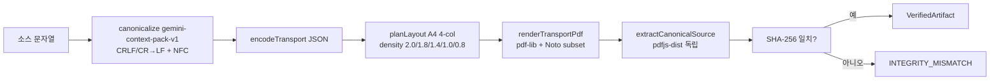

# GeminiContextPack

Gemini API context optimizer using native PDF packaging — reduce reported input tokens by up to 99% in measured long-context workloads.

[English](README.md)

[](https://github.com/ianlyoo/GeminiContextPack/actions/workflows/ci.yml)
[](LICENSE)
[](https://github.com/ianlyoo/GeminiContextPack/releases/tag/v0.1.0)
[](https://ianlyoo.github.io/GeminiContextPack/)

> 한국어 안내 — 위 영문 설명이 공식 표현입니다. 본 문서는 동일한 내용을 한국어로 설명합니다: Gemini API의 네이티브 PDF 패키징으로 측정된 long context 워크로드에서 reported input tokens를 줄이는 context optimization 도구입니다.

오프라인·결정적 컨텍스트 패키징. 모든 텍스트를 검증된 PDF 아티팩트(`gemini-context-pack-v1` canonicalization)로 컴파일하여 `inlineData: application/pdf` 단일 파트로 전송하고, **reported input tokens**를 비교합니다. 빌드 시에는 호스팅 서비스나 API 키가 필요하지 않습니다.

- TypeScript ESM, `node >=18`, `bun >=1`
- 번들된 OFL 폰트 (런타임 CDN 없음)
- 검증 가능: canonical source에 대한 SHA-256과 독립적인 `pdfjs-dist` 추출

## 빠른 시작 — Gemini API와 TypeScript로 네이티브 PDF 패키징하기

이 빠른 시작은 TypeScript로 작성된 Gemini API 헬퍼를 이용해 네이티브 PDF 패키징을 수행하며 완전히 오프라인으로 동작합니다.

### GitHub Release tarball로 설치 (npm registry 사용 안 함)

```bash
gh release download v0.1.0 --repo ianlyoo/GeminiContextPack --pattern "gemini-context-pack-*.tgz"
npm install ./gemini-context-pack-0.1.0.tgz
```

`gh`가 없을 때 로컬 tarball로 설치:

```bash
npm pack
npm install ./gemini-context-pack-0.1.0.tgz
```

### 클론, 빌드, 실행

```bash
git clone https://github.com/ianlyoo/GeminiContextPack.git
cd GeminiContextPack
bun install --frozen-lockfile
bun run build
```

### CLI로 컴파일/검증/검사 (compile / verify / inspect)

CLI는 오프라인이며 번들 폰트 헬퍼만 사용합니다 (`gemini-context-pack compile/verify/inspect`).

```bash
echo "hello world — deterministic example" > input.txt
node ./dist/cli.js compile --input input.txt --output out.pdf
node ./dist/cli.js inspect --pdf out.pdf
node ./dist/cli.js verify --pdf out.pdf --source input.txt
```

성공 시 JSON에 `canonicalizationId: "gemini-context-pack-v1"`, 64자리 `canonicalHash`/`expectedHash`/`extractedHash`, `pageCount`(1..32), `bytes`가 포함됩니다.

### TypeScript API

```ts
import { compileContextWithBundledFonts } from "gemini-context-pack/node";
import { verifyContextPdf } from "gemini-context-pack";
import { toGeminiInlinePart } from "gemini-context-pack/gemini";

const source = "hello world — deterministic example";
const artifact = await compileContextWithBundledFonts(source);
console.log(artifact.canonicalHash, artifact.pageCount);

const report = await verifyContextPdf(artifact.pdfBytes, source);
console.log(report.status); // "verified"

const part = toGeminiInlinePart(artifact);
// part = { inlineData: { mimeType: "application/pdf", data: "<base64>" } }
```

`compileContext`는 `fonts`를 필수로 요구하며(위 번들 헬퍼 사용), 알 수 없는 옵션은 거부됩니다. 지원되지 않는 글리프, 페이지 예산 초과, 추출 불일치는 `ContextPackError`로 실패합니다.

## 사용 사례 — long context 최적화

Long context 워크로드에서 reported input usage가 지배적인 경우 — 대용량 코퍼스, 다중 문서 합성, 또는 평문으로 전송하면 컨텍스트 윈도우를 채우는 검색 증강 프롬프트에 적합합니다.

- 20k 토큰 분량의 챕터를 `MEDIA_RESOLUTION_LOW`로 PDF 한 장에 패키징
- 래퍼 프롬프트를 동일하게 유지한 채 plain vs PDF를 `usage.prompt_token_count`로 비교
- 컴파일/검증은 오프라인 유지, 네트워크는 Gemini `generateContent`/`countTokens` 호출에만 필요 (opt-in live smoke)

시스템 프롬프트 인젝터, 투명 프록시, 범용 프로바이더 프레임워크가 아닙니다.

## 아키텍처 — context optimization 파이프라인



- `src/compiler.ts`는 `validate → canonicalize → coverage/layout → render → extract/hash → brand`를 fail-closed로 강제합니다.
- `src/pdf/`는 그래핌 분할(`Intl.Segmenter`), 폰트 커버리지, 적응형 레이아웃, 결정적 렌더링, 작성자 독립 검증을 담습니다.
- `src/gemini/`는 좁은 어댑터: `toGeminiInlinePart`(검증된 아티팩트 전용), `normalizeGeminiUsage`(snake/camel 모두 허용).
- `src/accounting/`은 일곱 종류(`estimated`, `provider-counted`, `provider-reported-usage`, `provider-reported-cost`, `pricing-snapshot`, `derived-comparison`, `benchmark-observation`)를 micro-USD와 provenance로 분리합니다.

## 벤치마크 — 측정된 워크로드의 reported input tokens

> 한정된 증거. 추적성은 `evidence/results.json`, `evidence/manifest.json`을 참조하세요. 비용·청구서 주장은 하지 않습니다.

**설정 (바로 인접한 제한사항):** 합성 코퍼스, seed 42 결정적 lorem 유사 텍스트(payload 포함, 자연어 아님); 조건당 1회 실행 (통계 분포 없음); 모델 `gemini-2.5-flash` 단독, `MEDIA_RESOLUTION_LOW` (MEDIUM/HIGH 변형은 raw에서 이미지 토큰 `532`/`1092`로 존재); provider-reported input tokens만 (`usage.prompt_token_count`); 캐시/래퍼/검색 구현이 plain과 PDF 간에 다름(raw `evidence/raw/*.json` 참조); 검색은 부분 문자열 일치; 청구서·달러 비용 없음; 정책·모델 동작·가격·토크나이저는 변경될 수 있음.

| Target | Plain `prompt_token_count` | PDF `prompt_token_count` | PDF details | Ratio | Reduction | Trace |
|---|---|---|---|---|---|---|
| 5000 | 5419 | 402 | 136 + 266 | 0.074 | 0.926 | `evidence/raw/plain_5k.json` (`940c31d2c6f4bf1f5af3e780c9196b2782bb0593fbe96c4469cdf31c3d873111`) vs `evidence/raw/pdf_5k.json` (`20513793f07e81a0e9a6cb2fa1ae5442f5636518293c4bdb465bfcb54aa3da54`) |
| 20000 | 20704 | 402 | 136 + 266 | 0.019 | 0.981 | `evidence/raw/plain_20k.json` (`bf24aadd77e5618514abebf3338c2360ee252a635c94bceb6f92b2821eea5be3`) vs `evidence/raw/pdf_20k.json` (`0ac77f528c6dbb4e6220b6b3c27f9a98c0677ab882221fabe6a4b132481abca4`) |
| 50000 | 51393 | 402 | 136 + 266 | 0.008 | 0.992 | `evidence/raw/plain_50k.json` (`0bc18322c2618a85f17e476dcf544e62a76240ebc2c03941d423d6e87365686c`) vs `evidence/raw/pdf_50k.json` (`db2b25ea3e5935c93d6946c400d086eae7a143e5eea9bb5262d871760866ef98`) |

- 모든 수치는 위 raw SHA에서 계산되며, 파생 보고서는 `evidence/results.json` (`e725a4f430405f7d6c14d179146a3fba0777752a0e15c0383fc02304688c6aba`)와 `evidence/results.md`에 의해 생성됩니다(`scripts/build-results.ts`). Raw 파일은 `evidence/manifest.json` 기준 private source와 byte-identical 입니다.
- 로컬 검증:

```bash
bun run evidence:verify
bun run bench:offline -- --out /tmp/offline.json
bun run evidence:build
```

- MEDIUM/HIGH 해상도 변형(`evidence/raw/pdf_5k_medium.json` → 532, `pdf_5k_high.json` → 1092)과 `pdf_5k_3flash.json`은 `evidence/raw`에 보존되지만 위 LOW 요약에는 포함되지 않습니다.

제한사항 재고지: 합성 seed 42, 조건당 1회, 모델 `gemini-2.5-flash`/`MEDIA_RESOLUTION_LOW`, 래퍼·캐시 영향 가능, 청구서·절감액 주장 없음, 정책 변경 가능.

## 검증 방법론

- Raw 벤치마크 아티팩트는 private `pagefold_validation/`에서 brand 스캔과 SHA manifest로 선별되어 byte-identical로 큐레이션되었습니다.
- `bun run evidence:verify`는 SHA/bytes, brand, secret, 미등록 파일, 파생 수치 추적성(5419/402 등)을 검사합니다.
- 오프라인 벤치마크(`benchmarks/offline.ts`)는 각 규모를 `compileContextWithBundledFonts` + `verifyContextPdf`로 컴파일/검증하고 `benchmark-observation` provenance를 기록합니다.

## 책임 있는 사용

Gemini API 동작, 토크나이저, 가격 정책은 변경될 수 있습니다. Reported input tokens는 청구서가 아닙니다. 본인의 워크로드에서 `normalizeGeminiUsage` provenance 기록으로 직접 측정하고, 합성 seed-42·단일 실행·`gemini-2.5-flash`/LOW 조건을 벗어난 일반화는 삼가십시오.

## 프로젝트 링크

- Issues: https://github.com/ianlyoo/GeminiContextPack/issues
- Pages: https://ianlyoo.github.io/GeminiContextPack/
- Evidence: `evidence/manifest.json`, `evidence/results.json`, `evidence/results.md`

## 라이선스

Apache-2.0 — `LICENSE`, `NOTICE`, `THIRD_PARTY_LICENSES.md` 참조.

## 감사의 글

Noto Sans CJK KR 및 Noto Emoji (OFL)는 불변 업스트림 커밋에서 벤더링되었습니다. `pdf-lib`, `fontkit`, `pdfjs-dist`는 각 라이선스를 따릅니다.

---

*증거 생성일 2026-08-25; `bun run evidence:verify`로 재검증하세요.*
