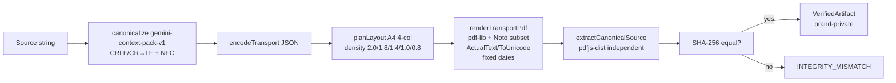

# GeminiContextPack

Gemini API context optimizer using native PDF packaging — reduce reported input tokens by up to 99% in measured long-context workloads.

[한국어](README.ko.md)

[](https://github.com/ianlyoo/GeminiContextPack/actions/workflows/ci.yml)
[](LICENSE)
[](https://github.com/ianlyoo/GeminiContextPack/releases/tag/v0.1.0)
[](https://ianlyoo.github.io/GeminiContextPack/)

Offline, deterministic context packaging for Gemini. Compile any text into a verified PDF artifact (`gemini-context-pack-v1` canonicalization), send it as a single `inlineData: application/pdf` part, and compare **reported input tokens** without hosted services or API keys at build time.

- TypeScript ESM, `node >=18`, `bun >=1`
- Bundled OFL fonts (no runtime CDN)
- Verifiable: SHA-256 over canonical source, independent `pdfjs-dist` extraction

## Quick start — native PDF packaging with Gemini API and TypeScript

This quick start uses native PDF packaging via the Gemini API helper surface, written in TypeScript, and runs entirely offline (no API key).

### Install from GitHub Release tarball (no npm registry)

```bash
gh release download v0.1.0 --repo ianlyoo/GeminiContextPack --pattern "gemini-context-pack-*.tgz"
npm install ./gemini-context-pack-0.1.0.tgz
```

Alternative when `gh` is unavailable — build from the packed tarball locally:

```bash
npm pack
npm install ./gemini-context-pack-0.1.0.tgz
```

### Clone, build, and run

```bash
git clone https://github.com/ianlyoo/GeminiContextPack.git
cd GeminiContextPack
bun install --frozen-lockfile
bun run build
```

### Use the CLI (compile / verify / inspect)

The CLI is offline and uses the bundled-font helper only (`gemini-context-pack compile/verify/inspect`).

```bash
echo "hello world — deterministic example" > input.txt
node ./dist/cli.js compile --input input.txt --output out.pdf
node ./dist/cli.js inspect --pdf out.pdf
node ./dist/cli.js verify --pdf out.pdf --source input.txt
```

Expected JSON on success includes `canonicalizationId: "gemini-context-pack-v1"`, 64-hex `canonicalHash`/`expectedHash`/`extractedHash`, `pageCount` (1..32), and `bytes`.

### TypeScript API

```ts
import { compileContextWithBundledFonts } from "gemini-context-pack/node";
import { verifyContextPdf } from "gemini-context-pack";
import { toGeminiInlinePart } from "gemini-context-pack/gemini";

const source = "hello world — deterministic example";
const artifact = await compileContextWithBundledFonts(source);
console.log(artifact.canonicalHash, artifact.pageCount);

const report = await verifyContextPdf(artifact.pdfBytes, source);
console.log(report.status); // "verified"

const part = toGeminiInlinePart(artifact);
// part = { inlineData: { mimeType: "application/pdf", data: "<base64>" } }
```

`compileContext` requires `fonts` (use the bundled helper above); unknown options are rejected; unsupported glyphs, page-budget overflow, or extraction mismatch fail with typed `ContextPackError`.

## Use cases for long context

Long context workloads where provider-reported input usage dominates — large corpora, multi-document synthesis, or retrieval-augmented prompts that would otherwise fill the context window as plain text.

- Pack a 20k-token textbook chapter into a single PDF part with `MEDIA_RESOLUTION_LOW`.
- Keep the same wrapper prompt across conditions and compare plain vs PDF via `usage.prompt_token_count`.
- Stay offline for compilation/verification; only the Gemini `generateContent`/`countTokens` call is networked (opt-in live smoke).

What this is not: a system prompt injector, a transparent proxy, or a generic provider framework.

## Architecture: context optimization pipeline



- `src/compiler.ts` enforces `validate → canonicalize → coverage/layout → render → extract/hash → brand` fail-closed; no partial artifact on failure.
- `src/pdf/` holds grapheme segmentation (`Intl.Segmenter`), font coverage, adaptive layout, deterministic rendering, and writer-independent verification.
- `src/gemini/` is the narrow adapter: `toGeminiInlinePart` (verified artifact only) and `normalizeGeminiUsage` (snake/camel tolerant, provenance-bearing).
- `src/accounting/` separates seven kinds (`estimated`, `provider-counted`, `provider-reported-usage`, `provider-reported-cost`, `pricing-snapshot`, `derived-comparison`, `benchmark-observation`) with micro-USD money and same-unit/provenance comparisons.

See `docs/architecture.md` for A–J detail.

## Benchmark: reported input tokens in measured workloads

> Qualified evidence only. See `evidence/results.json` and `evidence/manifest.json` for traceability. No cost or invoice claim is made.

**Setup (adjacent limitations):** Synthetic corpus, seed 42 deterministic lorem-style text with payload (not natural language); one run per condition (no statistical distribution); model `gemini-2.5-flash` primary with `MEDIA_RESOLUTION_LOW` (MEDIUM/HIGH variants exist as `532`/`1092` image tokens in raw); provider-reported input tokens only (`usage.prompt_token_count`); cache/wrapper/retrieval differ between plain and PDF (see raw `evidence/raw/*.json`); retrieval is substring match; no invoice data and no dollar cost is reported here; policy, model behavior, pricing, and tokenization may change.

| Target | Plain `prompt_token_count` | PDF `prompt_token_count` | PDF details (TEXT+IMAGE) | Ratio PDF/Plain | Reduction | Trace |
|---|---|---|---|---|---|---|
| 5000 | 5419 | 402 | 136 + 266 | 0.074 | 0.926 | `evidence/raw/plain_5k.json` (`940c31d2c6f4bf1f5af3e780c9196b2782bb0593fbe96c4469cdf31c3d873111`) → `usage.prompt_token_count` vs `evidence/raw/pdf_5k.json` (`20513793f07e81a0e9a6cb2fa1ae5442f5636518293c4bdb465bfcb54aa3da54`) |
| 20000 | 20704 | 402 | 136 + 266 | 0.019 | 0.981 | `evidence/raw/plain_20k.json` (`bf24aadd77e5618514abebf3338c2360ee252a635c94bceb6f92b2821eea5be3`) vs `evidence/raw/pdf_20k.json` (`0ac77f528c6dbb4e6220b6b3c27f9a98c0677ab882221fabe6a4b132481abca4`) |
| 50000 | 51393 | 402 | 136 + 266 | 0.008 | 0.992 | `evidence/raw/plain_50k.json` (`0bc18322c2618a85f17e476dcf544e62a76240ebc2c03941d423d6e87365686c`) vs `evidence/raw/pdf_50k.json` (`db2b25ea3e5935c93d6946c400d086eae7a143e5eea9bb5262d871760866ef98`) |

- Every numeric field above is computed from raw evidence SHA above; derived report at `evidence/results.json` (`e725a4f430405f7d6c14d179146a3fba0777752a0e15c0383fc02304688c6aba`) and `evidence/results.md` are generated by `scripts/build-results.ts`; raw files are byte-identical to private source per `evidence/manifest.json`.
- Verify locally:

```bash
bun run evidence:verify
bun run bench:offline -- --out /tmp/offline.json
bun run evidence:build
```

- MEDIUM/HIGH resolution raw variants (`evidence/raw/pdf_5k_medium.json` → 532, `pdf_5k_high.json` → 1092) and `pdf_5k_3flash.json` are preserved in `evidence/raw` but not in the primary LOW summary above.

Limitations restated: synthetic seed 42 corpus, one run per condition, model `gemini-2.5-flash` with `MEDIA_RESOLUTION_LOW`, wrapper/cache may affect provider counts, no invoice or savings claim, policy may change.

Additional offline determinism (same limitation context): 5k/20k/50k sources re-compiled via `compileContextWithBundledFonts` reproducibly select the largest fitting profile and yield byte-identical SHA on re-run; non-latency fields match across runs (see `benchmarks/offline.ts`).

## Validation methodology

- Raw benchmark artifacts are curated byte-identical from private `pagefold_validation/` (`evidence/raw/*.json`, `evidence/raw/corpus_*.pdf`) with forbidden-brand scanning and SHA manifest (`evidence/manifest.json`).
- `bun run evidence:verify` checks SHA/bytes, brand, secrets, unmanifested files, and derived number traceability (5419/402 etc.).
- Offline benchmark (`benchmarks/offline.ts`) compiles/verifies each scale with `compileContextWithBundledFonts` + `verifyContextPdf`, records `benchmark-observation` provenance.

See `docs/validation-methodology.md`.

## Responsible use

Gemini API behavior, tokenization, and pricing policy may change. Reported input tokens are not an invoice. Measure your own workload with `normalizeGeminiUsage` provenance records and do not extrapolate beyond the synthetic seed-42, single-run, `gemini-2.5-flash`/LOW setup documented above.

See `docs/responsible-use.md`.

## Project links

- Issues: https://github.com/ianlyoo/GeminiContextPack/issues
- Pages: https://ianlyoo.github.io/GeminiContextPack/
- Evidence: `evidence/manifest.json`, `evidence/results.json`, `evidence/results.md`
- Fonts: `assets/fonts/` (OFL, pinned commits)

## License

Apache-2.0 — see `LICENSE`, `NOTICE`, `THIRD_PARTY_LICENSES.md`.

## Acknowledgments

Noto Sans CJK KR and Noto Emoji (OFL) vendored from immutable upstream commits; `pdf-lib`, `fontkit`, `pdfjs-dist` under their respective licenses.

---

*Evidence produced offline on 2026-08-25; re-verify with `bun run evidence:verify`.*
