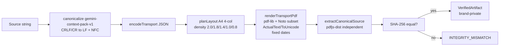

# GeminiContextPack — Architecture (A–J)

> **Disclaimer:** This is not an official Google product. GeminiContextPack is an independent open-source project and is not affiliated with, endorsed by, or sponsored by Google. Gemini API behavior, pricing, and tokenization may change without notice.
>
> Repository: https://github.com/ianlyoo/GeminiContextPack — Owner: ianlyoo — License: Apache-2.0 — Version: 0.1.0

This document follows the A–J order required by the project plan. Each section traces to the private audit (`.omo/drafts/gemini-context-pack.md`), curated evidence (`evidence/manifest.json`, `evidence/results.json`), and shipped contracts.

## A. Current Private Audit

Private prototype bundle contained three source modules (`src/core.js`, `src/pdf.js`, `src/index.js`) surrounded by vendored pako/fontkit/pdf-lib with no source tree, manifest, lockfile, tests, or source map. Ingress was prompt-chat args; egress was `{success, content}`; settings/storage/network/provider registration were host APIs.

Key findings:

- Role-flattening: current packaging serializes role-labelled strings and moves all messages or all non-system messages into PDF, preserving order as text but not native message-role authority.
- Reusable Unicode machinery: grapheme segmentation, font coverage, emoji runs, zero-width format-character Type3/ToUnicode mapping, line-level ActualText, deterministic wrapping, four-column A4 layout, font subsetting, page metrics.
- Provider logic was three concrete adapters (Gemini Developer vs Vertex shared body, differing auth/endpoint; alternative provider chat-completions file parts plus native parser) not a generic framework.
- Accounting mixed heuristic estimates, hard-coded per-page predictions, provider-reported tokens, fetched/manual pricing, derived savings, and provider-reported cost in shared aggregates.
- Validation harness: adaptive 2.0→0.8pt density, page count, local extraction, `countTokens`, usage modality breakdown, model/resolution variants, retrieval plus distant-fact checks (private generator, runners, raw JSON).
- Deterministic generator could fail open on page-counting/extraction failure and enlarge page height to preserve one page — PoC behavior, not production invariant.
- No root README, package metadata, license, community files, topics, Pages, or social preview.

Audit outcome: classify essential (deterministic Unicode PDF, verified artifact, narrowed Gemini adapter, separated accounting, evidence-qualified claim) vs accidental (host coupling, role flattening) vs provider-specific behavior.

## B. Evidence Validity

Raw evidence is curated byte-identical from the private validation directory into `evidence/raw/` with SHA manifest `evidence/manifest.json`:

- Included: `plain_5k.json` (`940c31d2c6f4bf1f5af3e780c9196b2782bb0593fbe96c4469cdf31c3d873111`), `pdf_5k.json` (`20513793f07e81a0e9a6cb2fa1ae5442f5636518293c4bdb465bfcb54aa3da54`), `plain_20k.json` (`bf24aadd77e5618514abebf3338c2360ee252a635c94bceb6f92b2821eea5be3`), `pdf_20k.json` (`0ac77f528c6dbb4e6220b6b3c27f9a98c0677ab882221fabe6a4b132481abca4`), `plain_50k.json` (`0bc18322c2618a85f17e476dcf544e62a76240ebc2c03941d423d6e87365686c`), `pdf_50k.json` (`db2b25ea3e5935c93d6946c400d086eae7a143e5eea9bb5262d871760866ef98`), plus `pdf_5k_medium.json`/`pdf_5k_high.json`/`pdf_5k_3flash.json`/`plain_5k_3flash.json` and three `corpus_*.pdf`. Excluded with reason `forbidden-brand-content`: `corpus_*.txt` (header forbidden-brand hit).
- Scan: whole-word forbidden-brand scan over filename and utf8/latin1 decoded bytes; legacy bundle and old derived reports excluded by rule.
- SHA/bytes: `bun run evidence:verify` hashes every manifest artifact, checks bytes equality and private-source equality (when source present), brand/secrets, unmanifested files, and legacy absence.
- Derived reports `evidence/results.json` (`e725a4f430405f7d6c14d179146a3fba0777752a0e15c0383fc02304688c6aba`) and `evidence/results.md` are generated by `scripts/build-results.ts` reading raw `usage.prompt_token_count` only, tracing each numeric field to `SHA + jsonPath` and `derivedFrom` SHA list. Raw bytes/values are never rewritten.

Limitations (adjacent to every claim): synthetic seed-42 deterministic lorem with payload (not natural language); one run per condition (no statistical distribution); model `gemini-2.5-flash` primary with `MEDIA_RESOLUTION_LOW` (MEDIUM/HIGH variants preserved as 532/1092 image tokens); provider-reported input tokens only (`usage.prompt_token_count`); cache/wrapper/retrieval differ between plain and PDF; retrieval is substring match; no invoice data and no dollar cost reported; policy, model behavior, pricing, and tokenization may change.

Primary observations (one run per condition, internally consistent): plain/PDF reported prompt tokens 5419/402, 20704/402, 51393/402 with PDF details TEXT 136 + IMAGE 266. Qualified reduction is up to 99% in measured long-context workloads under the above setup — not a guarantee.

## C. Considered Options

Product shape: transparent prompt compressor vs generic provider framework vs hosted proxy vs integrity-verified bulk-context artifact compiler with narrow Gemini attachment adapter. Chosen: artifact compiler. Rationale: preserves control-plane semantics, keeps provider surface minimal, matches verifiable offline compilation.

Abstraction: implicit role flattening (move all messages into PDF) vs explicit passive-context string input. Chosen: explicit string. Rationale: prevents silently moving control instructions into PDF; retrieval evidence did not validate instruction precedence.

Stack: Python-heavy PDF tooling vs TypeScript-first ESM with `pdf-lib`/`fontkit`/`pdfjs-dist`. Chosen: TypeScript-first SDK + CLI. Rationale: official Gemini JS SDK alignment, reuse of browser-neutral core, small package surface (`gemini-context-pack`, `gemini-context-pack/node`, `gemini-context-pack/gemini`, `gemini-context-pack/accounting`, CLI `gemini-context-pack`).

Accounting: shared aggregate vs seven-kind tagged provenance. Chosen: seven kinds (`estimated`, `provider-counted`, `provider-reported-usage`, `provider-reported-cost`, `pricing-snapshot`, `derived-comparison`, `benchmark-observation`) with integer micro-USD. Rationale: prevents mixing estimates with provider reports or cost with tokens.

Rebranding: keep old working name vs clean `GeminiContextPack` / `gemini-context-pack` / `gemini-context-pack-v1`. Chosen: clean names, no old-brand surface. Rationale: standalone GitHub discoverability, licensed reuse, zero-brand gate.

## D. Product / Users / Non-Goals

Product: offline, deterministic context packaging for Gemini. Compile any text into a verified PDF artifact (`gemini-context-pack-v1` canonicalization), send it as a single `inlineData: application/pdf` part, and compare reported input tokens with provenance-bearing usage records. No hosted service or API key at build time.

Target users:

- Developers optimizing long-context Gemini workloads where reported input usage dominates (large corpora, multi-document synthesis, retrieval-augmented prompts).
- Teams needing verifiable, offline compilation with SHA-256 over canonical source and independent `pdfjs-dist` extraction.

Non-goals (explicitly out of scope):

- Transparent request interception or system/developer/current-user instruction auto-packaging.
- Generic provider framework, alternative-provider adapter, Files upload/JWT, or hosted proxy/service.
- Dashboard, database, Kubernetes, telemetry, account system, or paid growth.
- Cross-provider claims, invoice guarantees, or ranking promises.
- Polyglot framework/service beyond the TypeScript SDK + CLI.

## E. Modules / API

```
src/
  canonicalization.ts   # gemini-context-pack-v1: CRLF/CR→LF + NFC, whitespace preserved, JSON transport
  types.ts              # VerifiedArtifact (private brand), VerificationReport, FontBundle, CompileOptions
  errors.ts             # exhaustive ContextPackErrorCode union
  compiler.ts           # validate→canonicalize→coverage/layout→render→extract/hash→brand (fail-closed)
  fonts/types.ts        # FontBundle interface (bytes-only, no fs)
  fonts/node-loader.ts  # node:fs manifest + loadBundledFonts / compileContextWithBundledFonts
  pdf/graphemes.ts      # Intl.Segmenter grapheme clustering, zero-width format handling
  pdf/font-coverage.ts  # per-codepoint coverage, UNSUPPORTED_GLYPH with offset
  pdf/layout.ts         # A4 4-col, margin 10pt, gap 5pt, adaptive 2.0/1.8/1.4/1.0/0.8
  pdf/format-font.ts    # Type3 format font + ToUnicode
  pdf/runs.ts           # run segmentation
  pdf/render.ts         # pdf-lib + fontkit subsetting, ActualText per line, fixed dates
  pdf/extract.ts        # pdfjs-dist legacy, draw-order join, EOL stripped, 64MiB/32-page guard
  pdf/verify.ts         # SHA equality decides verified; strict variant throws INTEGRITY_MISMATCH
  gemini/inline-part.ts # toGeminiInlinePart — verified artifact only → {inlineData:{mimeType,data}}
  gemini/usage.ts       # normalizeGeminiUsage — snake/camel tolerant, provenance-bearing
  gemini/types.ts       # GeminiUsageRecord etc.
  accounting/           # seven kinds, micro-USD, same-unit/provenance comparison
  cli.ts                # parseArgs dispatch compile/verify/inspect
  node.ts               # re-exports node loader
  index.ts              # public surface re-exports
```

Public API:

```ts
import { compileContextWithBundledFonts } from "gemini-context-pack/node";
import { verifyContextPdf } from "gemini-context-pack";
import { toGeminiInlinePart } from "gemini-context-pack/gemini";

const source = "hello world — deterministic example";
const artifact = await compileContextWithBundledFonts(source);
// artifact.canonicalHash, artifact.pageCount, artifact.canonicalizationId === "gemini-context-pack-v1"

const report = await verifyContextPdf(artifact.pdfBytes, source);
// report.status === "verified" iff SHA equal

const part = toGeminiInlinePart(artifact);
// { inlineData: { mimeType: "application/pdf", data: "<base64>" } }
```

Constraints: `compileContext` requires `fonts` (use `compileContextWithBundledFonts`); unknown options (`role`, `messages`, `verify`) are rejected with `INVALID_CONTEXT`; unsupported glyphs, page-budget overflow, or extraction mismatch fail with typed `ContextPackError`; branded `VerifiedArtifact` cannot be forged (private `verifiedBrand` symbol).

Package exports: `.` (core), `./node` (bundled fonts), `./gemini` (inline part + usage), `./accounting` (records/comparison). Bin: `gemini-context-pack`. Engines: `node >=18`, `bun >=1`. TypeScript ESM strict.

## F. Integrity / Gemini / Accounting

Integrity pipeline (fail-closed, no partial artifact on failure):



- Canonicalization `gemini-context-pack-v1` normalizes CRLF/CR→LF and NFC, preserves whitespace; equality is hash over canonical form.
- Transport is JSON `{v, content}` reversible for newlines/backslashes/quotes/control/bidi/ZWJ/CJK/emoji; truncated or malformed JSON throws `INVALID_TRANSPORT`/`MALFORMED_PDF`.
- Coverage/layout: per-codepoint font coverage (primary Noto Sans KR vs emoji vs zero-width format), word-aware wrapping (55% early-break, 140.07pt column width), adaptive density selects largest fitting profile within `pageBudget` default 1 (max 32) and 64MiB.
- Rendering: ordered column drawing left→right top→bottom, `pdf-lib` + `fontkit` subsetting, line-level `ActualText` via BDC Span, zero-width Type3 format font with Differences/CMap, fixed CreationDate/ModDate `2023-01-01T00:00:00.000Z` and `useObjectStreams:false` for byte stability, producer `gemini-context-pack`.
- Verification: `pdfjs-dist` (legacy, `disableWorker:true`, `isEvalSupported:false`, cloned buffer) joins `textContent.items[].str` in draw order, strips extractor-added `\r\n/\r/\n`, decodes transport, hashes canonical source; only SHA equality yields `verified`. Limits: `64MiB`, `32 pages` each throw `PDF_LIMIT_EXCEEDED` with typed limit string; malformed data throws `MALFORMED_PDF`; signal abort throws `ABORTED`.

Gemini adapter (narrow):

- `toGeminiInlinePart` accepts only branded `VerifiedArtifact` (runtime `isVerifiedArtifact` check); returns `{inlineData:{mimeType:"application/pdf", data: base64}}` via `Buffer` or chunked `btoa`. No Files upload, auth, JWT, OpenRouter, or system composition.
- `normalizeGeminiUsage` parses official JS SDK shape (`usageMetadata` camel) and historical Python shape (`usage` snake, `raw` wrapper), tolerant to snake/camel and `prompt_token_count`/`promptTokenCount`, `prompt_tokens_details`/`promptTokensDetails`. At least one token/modality required; missing values remain `undefined` (not zero-filled). Every record carries `kind:"provider-reported-usage"` and provenance (`id`, `observedAt`, `sourceLocator`, `rawSha256`, `provider`, `model`). Modality breakdown verified: LOW 266, MEDIUM 532, HIGH 1092 image tokens.

Accounting taxonomy (seven kinds, distinct shapes):

- `estimated` {method, tokens}, `provider-counted` {counterId, tokens}, `provider-reported-usage` {inputTokens, totalTokens}, `provider-reported-cost` {amountMicroUsd, currency}, `pricing-snapshot` {inputPerMillionMicroUsd, outputPerMillionMicroUsd, effectiveAt}, `derived-comparison` {baselineId, candidateId, inputRecordIds, roundingRule}, `benchmark-observation` {durationMs, repetitions, inputTokens}. Each requires `id`, `observedAt` ISO, `sourceLocator`, `rawSha256` 64-hex, plus optional provider/model.
- Money: integer micro-USD (`1 USD = 1_000_000`), pricing per-million micro-USD same invariant; `0.75/1M = 750_000`; float dollar rejects at creation. `derived-comparison` mandates `inputRecordIds` (must include baseline+candidate, plus pricing if priced) and `roundingRule` (`floor|ceil|nearest|trunc`).
- Comparison enforces same-unit (`tokens` vs `cost` vs `pricing` vs `comparison` vs `benchmark`) and same-provenance (exact kind equality); mixing `estimated` vs provider without `allowMixedProvenance` throws `MIXED_PROVENANCE`, mixing units throws `MIXED_UNIT`, comparing derived or pricing-vs-pricing throws `UNLABELED_TOTAL`.

## G. QA / Benchmark

QA strategy: TDD, strict `tsc --noEmit`, Biome, offline determinism gate, brand/secret/license/claim gates.

Test surfaces:

- Canonicalization: reversible transport table/property, NFC/NFD equality, whitespace distinction, truncated/empty/budget failures no partial output.
- Fonts: `bun run fonts:verify` offline asserts immutable commit URL (40-hex, no `/main/`), SHA-256, bytes, OFL text + Google attribution; `src/fonts` tests cover manifest immutability and core no-fs import.
- Evidence: `bun run evidence:verify` + `test/evidence.test.ts` (11 cases) including byte-mutation, unmanifested, brand, numeric tamper failure fixtures.
- PDF: graphemes (English/CJK/emoji/ZWJ/VS16), coverage (U+0378 offset), layout (deterministic profile/page, LOC gate), render (`%PDF`, A4 MediaBox, ActualText/ToUnicode parser, byte SHA equality), extract/verify (Unicode/newline round-trip, typed failures, 32/33 boundary, EOL ignored).
- Compiler: `test/compile-context.integration.test.ts` (deterministic multilingual, private brand unforgable, abort before/after, coverage/budget mismatch, no cache mutation, CRLF hash).
- Gemini: `src/gemini` inline base64 round-trip + forged-brand rejection, historical modalities 266/532/1092, camel/snake identical, provenance, malformed no-invented-totals.
- CLI: `test/cli.integration.test.ts` (help, happy 5k compile→inspect→verify, existing output, wrong source, malformed PDF, page overflow, usage, unknown flag; each asserts exit code, JSON code, file preservation via before/after SHA, no `stack` leak). `node dist/cli.js --help` exit 0.
- Readme/metadata: `test/readme-metadata.test.ts` parses H1/language links/code fences/benchmark traces, executes quick-start in temp tarball consumer, claim checker maps numeric to SHA/path and rejects unqualified percentage-plus/always/invoice ranking claims.

Benchmark:

- **Offline** `benchmarks/offline.ts` + `benchmarks/schema.ts`: deterministic `compileContextWithBundledFonts` + `verifyContextPdf` for 5k/20k/50k seed-42 corpora (VOCAB from private generator but `_`/`-` instead of spaces to avoid wrap trim loss). Records `benchmark-observation` with provenance. `deterministicProjection` strips `latency/observedAt`; two runs match all non-latency fields (bytes 33316/95608/222410, hashes, profiles 2.0/2.30 and 1.4/1.61). `bun run bench:offline -- --out <path>` emits JSON with limitations.
- **Derived qualified reports** `evidence/results.json/md` trace 5419, 20704, 51393 (plain) and 402 per PDF (136 TEXT + 266 IMAGE) to raw SHA+`usage.prompt_token_count`. `scripts/build-results.ts` verifies raw integrity before deriving (hash vs manifest) and updates manifest derived SHA/bytes.
- **Live smoke** `benchmarks/live-gemini.ts` opt-in symmetric (`--run-live` + `GEMINI_API_KEY`), identical `GenerateContentConfig` `{temperature:0, maxOutputTokens:8192, mediaResolution: LOW}`, model `gemini-2.5-flash`, defaults 5k/seed42/LOW/one model/each 1 run, max 2 calls via capped client, redaction via split `[REDACTED]`, SDK `@google/genai@2.18.0`, `countTokens`/`generateContent` symmetry verified by `benchmarks/live-gemini.test.ts` (18 cases). Workflow `.github/workflows/live-smoke.yml` is `workflow_dispatch` only; required CI never references its secret. `bun run test:live` without flag/key prints `[live-gemini] SKIP: live smoke requires --run-live flag and GEMINI_API_KEY env — no network call` and exits 0.

No package publish, no paid stress test beyond documented scales, no cross-provider claims.

## H. Clean-Room / Release

Clean-room boundary:

- Product root `C:/Users/torch/Documents/GeminiContextPack` sits outside ancestor `C:/Users/torch/Documents/code/.git`; `git -C <root> rev-parse --show-toplevel` equals exact root, `branch --show-current` is `main`, remote list empty before publication.
- No history leakage: fresh `git init -b main` with first commit containing only `.gitignore` (node/dist/coverage/env/logs/OS/editor/tmp/.omo) and `.editorconfig` (utf-8/lf/space-2). No ancestor commit SHA overlap, no tracked `.omo/.codegraph/`, no sibling/env/credential files.
- Source is clean-room TypeScript: function names and behavior re-derived from private behavior description, not copied bundle/vendor code; vendored bytes are only pinned OFL fonts with attribution.

Release controls:

- Package `gemini-context-pack@0.1.0` ESM, Apache-2.0, `files` allowlist (`dist`, `assets`, `LICENSE`, `NOTICE`, `THIRD_PARTY_LICENSES.md`, `README.md`) excludes `evidence/raw`, Pages source, source maps, `.env`, private bundle names; `scripts/package-audit.ts` (and `scripts/release-audit.ts` clean-room/history/brand/secret/license/claim gates) verify.
- Offline gate: `bun install --frozen-lockfile && bun run lint && bun run typecheck && bun test && bun run build && bun run bench:offline && bun run docs:check && bun run release:audit && npm pack --dry-run` exit 0 without credential/network.
- `npm pack` artifact checksums → annotated `v0.1.0` tag/GitHub Release; no `npm publish`, no GitHub Packages publish.
- Metadata/search verification via `gh repo view/api` and Pages HTTP; search hit is eventual-consistency observation only, not claimed.
- Owner-only steps: social-preview Settings upload and profile pin are browser actions, surfaced as `OWNER_ACTION_REQUIRED` with exact path/query, not auto-completed.

## I. Discoverability / Responsible Use

Discoverability:

- GitHub description exactly `Gemini API context optimizer using native PDF packaging — reduce reported input tokens by up to 99% in measured long-context workloads.` (em dash U+2014) mirrored in `README.md` H1 first paragraph, `README.ko.md`, `package.json` description, `CITATION.cff` abstract, `codemeta.json` description, `docs/index.html` meta/JSON-LD, and `evidence/results.json` branding. No keyword stuffing (comma-separated keyword block detection fails); keywords placed naturally in headings: native PDF packaging, Gemini API, long context, context optimization, reported input tokens, TypeScript.
- Topics exactly `gemini-api`, `google-gemini`, `native-pdf`, `long-context`, `context-window`, `context-optimization`, `token-optimization`, `pdf`, `typescript`, `llm`, `prompt-engineering`, `developer-tools` (12, lowercase hyphenated, ≤20) mirrored in `package.json` keywords, `codemeta.json` keywords, README/Pages without ranking guarantee. Search qualifiers `in:name/description/topics/readme` supported.
- Linked READMEs: English primary (`README.md` ↔ `README.ko.md` via `[한국어]`/`[English]`), `docs/*.md` references, Pages under `/docs` with canonical URL `https://ianlyoo.github.io/GeminiContextPack/`, sitemap/robots, Open Graph/Twitter, `SoftwareSourceCode` JSON-LD (`name`, `version`, `codeRepository`, `license`, `keywords`).
- Release tarball install only: `gh release download v0.1.0 --repo ianlyoo/GeminiContextPack --pattern "gemini-context-pack-*.tgz"` + `npm install ./gemini-context-pack-0.1.0.tgz` (or `npm pack` local). No `npm install gemini-context-pack` registry form; no `npx`.
- Badges limited to CI (`ci.yml`), Apache-2.0, v0.1.0 release, Pages; no `img.shields.io/npm/d` download badge.

Responsible use (see `docs/responsible-use.md`):

- Gemini API behavior, tokenization, and pricing policy may change; reported input tokens are not an invoice; no cost/savings or invoice claim is made.
- Measure your own workload with `normalizeGeminiUsage` provenance records; do not extrapolate beyond synthetic seed-42, single-run, `gemini-2.5-flash`/LOW setup.
- Keep control-plane text (system/developer/current task) outside the artifact; designate only passive context for PDF packaging.
- Honor content policies: do not package disallowed content to evade filters; verify extraction before sending.
- Report limitations alongside any numbers shared.

## J. V1 / Later / Avoid

V1 (shipped):

- TypeScript ESM package `gemini-context-pack@0.1.0` with four exports + CLI, strict contracts, private brand, typed errors, exhaustive switches.
- Pinned offline Noto CJK KR + Emoji (OFL), manifest-verified loader, node helper `compileContextWithBundledFonts`.
- Deterministic Unicode layout (Intl.Segmenter, 4-col A4, adaptive 5 profiles), `pdf-lib`/`fontkit` rendering with ActualText/ToUnicode, `pdfjs-dist` independent verification, fail-closed orchestration.
- Narrow Gemini inline part + snake/camel usage normalizer (provenance, modality details 266/532/1092).
- Seven-kind accounting with micro-USD and same-unit/provenance comparison.
- Curated immutable evidence (manifest, `evidence:verify`, derived builder), bilingual README, docs A–J, community health (CONTRIBUTING, CODE_OF_CONDUCT, SECURITY via GitHub private vulnerability reporting), issue/PR templates, `CITATION.cff`, `codemeta.json`, `CHANGELOG.md`.
- Offline benchmark + opt-in live smoke (`workflow_dispatch` only), CI, package/release audits, GitHub Release tarball (no npm registry).

Later (explicitly deferred):

- Additional Gemini models/resolutions beyond documented variants (already preserved as raw `pdf_5k_medium/high`, `3flash`).
- Multimodal image beyond native PDF attachment (out of narrow adapter scope).
- Pages enhancements or searchable landing-page interactivity beyond static SEO assets (if approved).
- Expanded offline corpus languages beyond current CJK/emoji coverage vectors (requires glyph/benchmark extension).

Avoid (will not do):

- Legacy brand surfaces (whole-word presence fails release audit).
- Role-flattening message moves, transparent proxy, generic provider framework, alternative-provider adapter.
- Host-dependent settings/storage/network APIs or mutable CDN font fetch.
- Silent fallback on unsupported glyphs/page overflow/extraction mismatch; warning-success; custom page height; global cache.
- Secrets in source/logs/snapshots/Pages/release; hosted service/dashboard/Kubernetes/telemetry; artificial promotion, keyword stuffing, featured-topic spam, or ranking/indexing claims.
- `npm publish`, GitHub Packages publish, custom domain purchase, paid stress beyond 50k.

---

*Generated 2026-08-25 (offline). Re-verify with `bun run typecheck && bun run evidence:verify && bun run bench:offline -- --out /tmp/offline.json && bun run docs:check`.*
